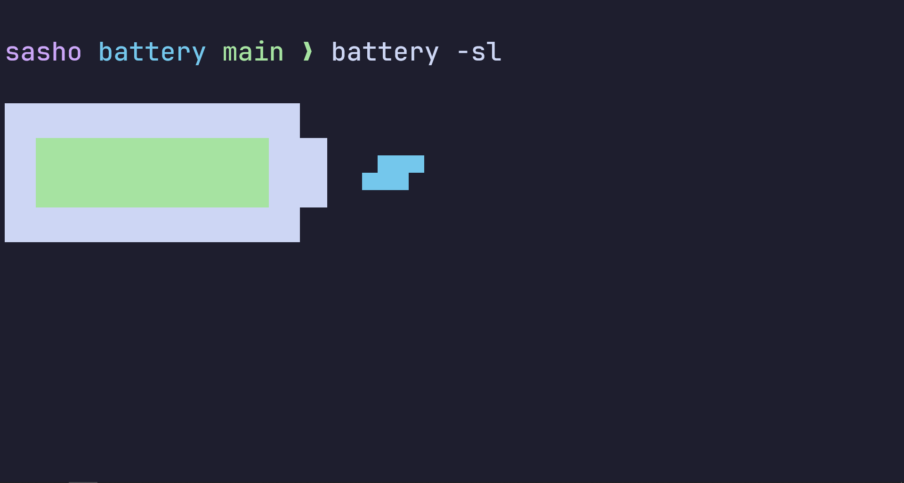

# Battery

### Simple utility to monitor the battery in a stylish manner.


### Small version:


### Version with some extra options:


## Installation

```bash
git clone https://github.com/sasheto-phizika/battery.git
cp battery/battery ~/.local/bin # user installation
sudo cp battery/battery /usr/bin # system installation

```

## Usage

Basic:
```
battery
```
To stay and monitor live (`q` or `Ecs` to exit):
```
battery -l
```
For a small inline battery (also works with `-l` and might not print properly in a `tty`):
```
battery -s
```
If you want a slightly thicker battery:
```
battery -f

```
To print the current battery as a number inside the picture and can be toggled by pressing `d` in live mode (doesn't work with `-s`):
```
battery -d
```
For minimal text output:
```
battery -m
``
The `-m` flag overwrites flags above.

If you want to change the colors, modify the top of the script using ANSI escape codes (`\033[38;2;R;G;Bm` format for terminals with true color support).

To use and alternate charging symbol (requires nerd fonts installed):
```
battery -c
```

To remove colors:
```
battery -n
```
To specify the battery:
```
battery -b BAT_NUMBER
```
The default is the one with the smallest number found in `/sys/class/power_supply/` (usually 0, equivalent to `-b 0`).
